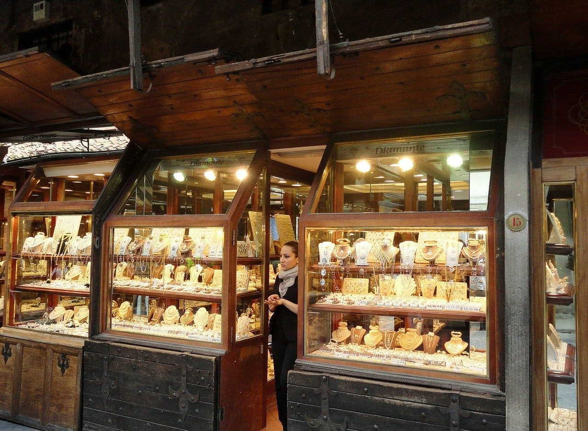

# ZeroPlus Gate - Luxury Brand Site

この作品はZeroPlusのWeb制作課題で制作した、架空ジュエリーブランドのランディングページ風サイトです。

## 🔧 使用技術

- HTML5 / CSS3
- Google Fonts（Noto Serif JP / Noto Sans JP）
- Flexbox
- リセットCSS（destyle.css）

## 🖼️ 概要

高級感あるLPを意識し、「コンセプト」「商品紹介」「店舗情報」セクションで構成。商品紹介部分は左右交互レイアウトで、視覚的にリズムを持たせています。

## 📸 スクリーンショット

| キービジュアル | 商品例 | 店舗情報 |
|----------------|--------|----------|
|  |  |  |

## 🌍 公開URL

[https://marushin0504.github.io/luxury-brand-site/](https://marushin0504.github.io/luxury-brand-site/)

## 📝 備考

このWebサイトは教育目的の制作物であり、実在のブランドや情報とは一切関係ありません。
